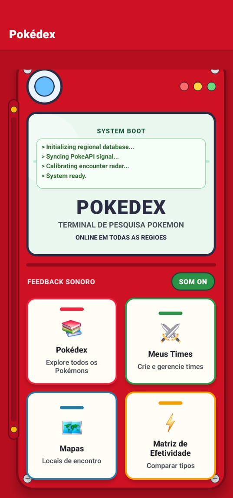
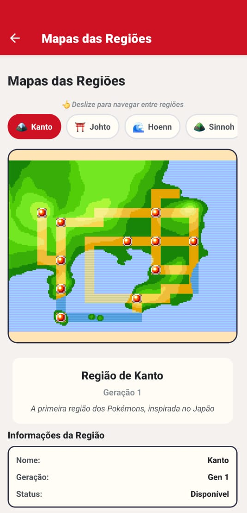
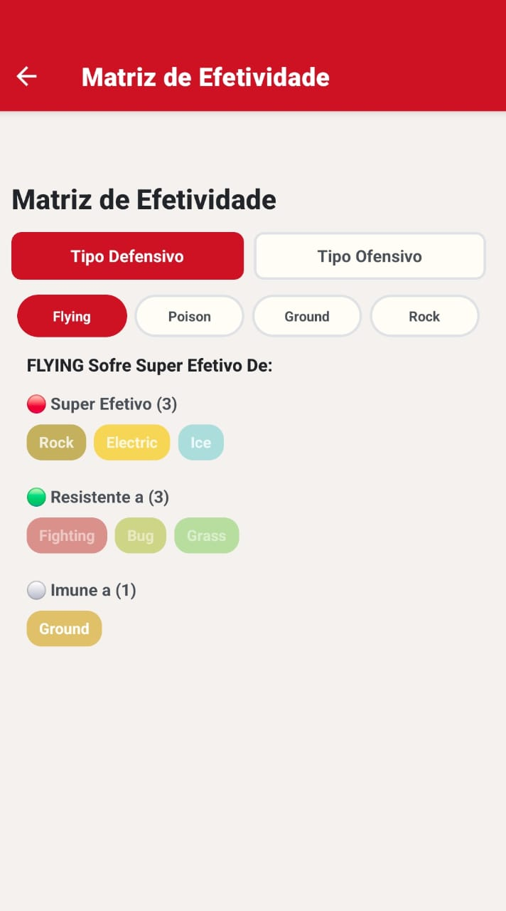
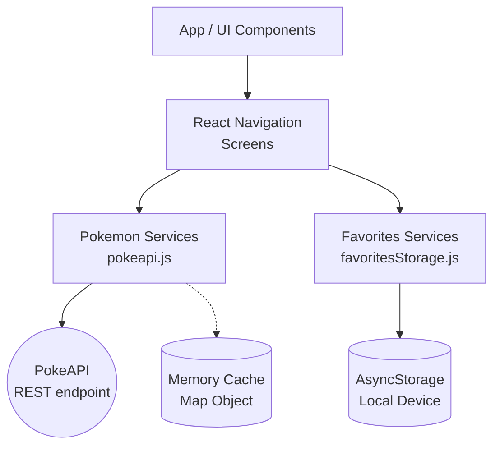

# Pokédex Multirregiões (Mobile) 📱


## Descrição do Trabalho
Este projeto é uma aplicação mobile construída em React Native com a utilização do framework Expo. Trata-se de uma Pokédex que permite aos usuários listar Pokémons por regiões e analisar seus status, tipos, dados físicos e construir times customizados. A aplicação interage com a PokeAPI e faz uso da persistência de informações localmente no dispositivo para as funções offline.

## Telas do App
<p align="center">







</p>

## Funcionalidades
- **Catálogo de Pokémons:** Visualização de Pokémons filtrados pelas gerações da franquia atual (Kanto, Johto, Hoenn, Sinnoh, Unova, Kalos, Alola, Galar, Paldea).
- **Detalhes por Pokémon:** Página sobre cada Pokémon com tipos, habilidades, status completos, tamanho, peso e imagens normais e shiny. 
- **Gerenciamento de Times:** Criação, edição e visualização de times customizados.
- **Busca e Sugestão Integrada:** Pesquisa otimizada com autocompletar na busca por nome ou número do Pokémon.
- **Matriz de Efetividade:** Tela dedicada para ajudar os jogadores a consultarem de tabela os bônus ou fraquezas elementais de cada tipo de Pokémon em combate.
- **Visualização de Mapas e Movimentos:** Áreas da aplicação destinadas à informações do mundo e à lista de golpes.
- **Sistema Local de Armazenamento:** Preservação de dados através do Async Storage (times e favoritos).

## Tecnologias Utilizadas e Dependências
- **React Native** & **Expo (v54)**: Framework de desenvolvimento Mobile híbrido base do projeto.
- **React Navigation v6**: Para gerenciamento de rotas e navegação em pilha da aplicação.
- **AsyncStorage**: Ferramenta para dados offline.
- **API Fetch / PokeAPI**: Utilização da api externa [PokeAPI](https://pokeapi.co/) valendo-se da função `fetch` com implementação de cache assíncrono avançado para evitar requisições sequenciais.

## Diagrama de Arquitetura


## Documentação da API e Endpoints

Toda a aplicação consome os dados vitais de Pokémon da biblioteca global e gratuita [PokeAPI](https://pokeapi.co/). Foram integrados os seguintes endpoints diretos de requisição (veja toda a lógica em `src/services/pokeapi.js`):

- **Listagem Paginada:** `GET https://pokeapi.co/api/v2/pokemon?limit={limit}&offset={offset}`
- **Dados por Região:** `GET https://pokeapi.co/api/v2/generation/{id}`
- **Detalhes Específicos:** `GET https://pokeapi.co/api/v2/pokemon/{id_ou_nome}`
- **Cadeia de Evolução:** É feito o hit primeiro em `GET https://pokeapi.co/api/v2/pokemon-species/{id}` e na sequência as evoluções são buscadas lendo a URL apontada dentro da propriedade `evolution_chain` devolvida em JSON pela URL anterior.

## Estrutura de Pastas
```text
/
├── App.js                   
├── app.json                
├── package.json           
├── src/
│   ├── components/          
│   ├── screens/             
│   │   ├── StartScreen.js
│   │   ├── HomeScreen.js            
│   │   ├── PokemonDetailsScreen.js  
│   │   ├── TeamsScreen.js           
│   │   ├── TeamDetailScreen.js      
│   │   ├── MapsScreen.js            
│   │   ├── EffectivenessMatrixScreen.js 
│   │   └── MovesScreen.js
│   ├── services/            
│   │   ├── pokeapi.js          
│   │   └── favoritesStorage.js 
│   └── utils/               
└── assets/                  
```

## Instalação e Execução

### Pré-requisitos
Para o ambiente de desenvolvimento, é necessário:
- **Node.js** devidamente configurado e operacional.
- O App **Expo Go** ([Android](https://play.google.com/store/apps/details?id=host.exp.exponent) | [iOS](https://apps.apple.com/br/app/expo-go/id982107779)) em seu smartphone Físico **OU** um ambiente vitual de emulador de Android Studio / iOS Simulator (Mac).

### Passo a Passo

1. **Faça o clone e entre na raiz do repositório**
   ```bash
   git clone https://github.com/SEU_USUARIO/NOME_DO_REPOSITORIO.git
   cd Pokedex_TrabalhoMobile
   ```

2. **Instale todas as dependências**
   Utilizando o gerenciador de pacotes NPM, que cuidará das bibliotecas react e expo:
   ```bash
   npm install
   ```

3. **Inicie o servidor Metro Bundler (Expo Start)**
   Pelo terminal, com um único comando suba seu ambiente:
   ```bash
   npm start
   ```
   > 💡 **Aviso de Rede:** Caso o seu celular não consiga conectar lendo o QR Code, pare o servidor e levante utilizando um **túnel**:
   > ```bash
   > npm run start:tunnel
   > ```

4. **Abra o aplicativo**
   - **No smartphone Físico:** Conecte na mesa rede Wi-Fi que o seu PC e escaneie o código QR exibido no console do comando utilizando o Expo Go (Android) ou seu aplicativo nativo de Câmera (iOS).
   - **Em emuladores Físicos:** Assim que o terminal de Start gerar as opções, pressione a tecla **`a`** para abrir no emulador de Android conectado, ou **`i`** para abrir do iOS Simulator.

## Solução de Problemas Comuns

### Erro: "Failed to Download remote update"

**Como resolver:**
1. Pare de rodar a aplicação em seu terminal (`Ctrl + C`).
2. Reinicie o servidor limpando o cache do Expo, adicionando a flag `-c`:
   ```bash
   npm start -- -c
   # ou
   # npx expo start -c
   ```
3. Feche o aplicativo do Expo Go no seu celular (remova da lista de apps recentes) e o abra novamente.
4. Caso o problema persista, acesse as "Configurações" > "Aplicativos" do seu aparelho móvel e limpe o **Dado/Cache** do app Expo Go.

## Autores
- Desenvolvido por **Ana Laura Silva Pereira, Camilo Veríssimo Garcia Prado e Lucas Eduardo Alves Vizoto** 
