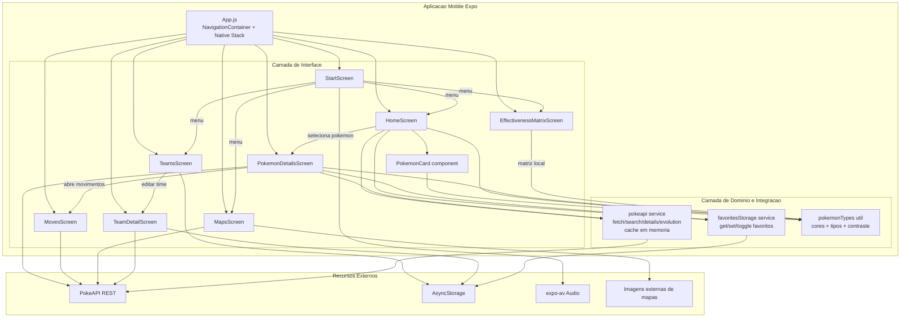

# Arquitetura do Projeto Pokedex Mobile

## Visao geral
Aplicativo mobile React Native + Expo com navegacao em stack. A interface fica em screens/components, regras de integracao ficam em services e utilitarios em utils.

## Diagrama de arquitetura

## Responsabilidades por camada
- App.js: define navegacao global e rotas.
- Screens: composicao de UI, estado local e fluxo entre funcionalidades.
- Components: blocos reutilizaveis de apresentacao, ex.: card de pokemon.
- Services: acesso a dados remotos e persistencia.
- Utils: regras pequenas e puras de apoio visual/formatacao.

## Fluxos principais
- Exploracao da pokedex: Start -> Home -> PokemonDetails -> Moves.
- Favoritos globais: Home/PokemonDetails -> favoritesStorage -> AsyncStorage.
- Gerenciamento de times: Teams -> TeamDetail -> AsyncStorage e lista de Pokemon.
- Mapas por regiao: Maps -> PokeAPI + imagens externas.
